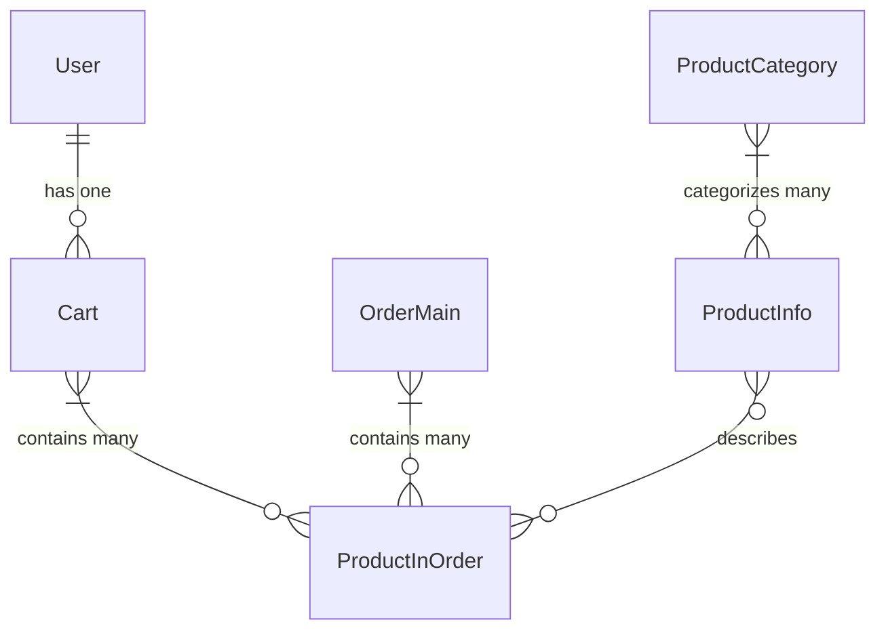

# Chapter 1: Data Models (Entities)

Welcome to the first chapter of our deep dive into the Spring Boot and Angular Online Shopping Store project! In this chapter, we're going to explore the very foundation of our application: **Data Models**, often called **Entities**.

### What Problem Do Data Models Solve?

Imagine you're building a real-world online store. What kind of information do you need to keep track of?
*   Details about each product: its name, price, description, how many are in stock.
*   Information about your customers: their email, address, phone number.
*   What's currently in a customer's shopping cart.
*   Records of completed orders.
*   Ways to group products, like "Electronics" or "Books" (categories).

Without a clear structure, this information would be a messy pile! How would you know which price belongs to which product, or which items are in whose cart?

This is where **Data Models (Entities)** come in. They are like official "blueprints" or "forms" that define exactly how we will record and organize each piece of information in our online store. Think of them as the standardized forms used in a big office to make sure everyone records details about, say, "new employees" or "equipment orders" in the exact same way.

By defining these blueprints, we ensure that our data is consistent, easy to store, and easy to retrieve.

### What are Data Models (Entities) in Our Project?

In our Spring Boot application, Data Models are simply **Java classes** that represent these real-world objects. Each class describes the "properties" or "fields" that define that object. For example, a `ProductInfo` entity will have fields like `productName`, `productPrice`, and `productStock`.

The magic comes from a technology called **JPA (Java Persistence API)**, often implemented by **Hibernate** in Spring Boot. These tools read our Java classes and automatically create corresponding **tables** in our database. Each object we create from these classes (e.g., a specific "Laptop" product) then becomes a **row** in that database table.

Let's look at the core entities in our online store:

#### 1. `ProductInfo` (Product Information)

This entity is the blueprint for all the products you can sell in your store.

```java
// backend\src\main\java\me\zhulin\shopapi\entity\ProductInfo.java
package me.zhulin.shopapi.entity;

import lombok.Data; // Provides getters, setters automatically
import javax.persistence.*; // For database mapping annotations
import java.math.BigDecimal;

@Entity // This annotation tells JPA/Hibernate to map this class to a database table
@Data   // Makes our code cleaner by generating standard methods
public class ProductInfo {
    @Id // Marks 'productId' as the unique identifier (primary key) for each product
    private String productId;

    private String productName;      // Name of the product
    private BigDecimal productPrice; // Price of the product (e.g., $19.99)
    private Integer productStock;    // How many units are available

    // ... other properties like description, image icon, etc.
}
```

*   **`@Entity`**: This is the most important annotation here. It tells Spring Boot (and Hibernate) that this `ProductInfo` Java class is a "data model" and should be linked to a table in our database. By default, the table will be named `product_info`.
*   **`@Id`**: This annotation specifies that `productId` is the primary key, which uniquely identifies each product in the database.
*   **`@Data`**: This is a Lombok annotation that helps us write less boilerplate code. It automatically generates common methods like `getProductName()`, `setProductPrice()`, `toString()`, etc.

#### 2. `ProductCategory` (Product Categories)

This entity helps organize products into different categories.

```java
// backend\src\main\java\me\zhulin\shopapi\entity\ProductCategory.java
package me.zhulin.shopapi.entity;

import lombok.Data;
import javax.persistence.*;

@Entity
@Data
public class ProductCategory {
    @Id
    @GeneratedValue // The database will automatically create a unique ID for new categories
    private Integer categoryId;

    private String categoryName; // E.g., "Electronics", "Books", "Clothing"
    private Integer categoryType; // A unique number for each category type

    // ... timestamps for creation/update time
}
```

This `ProductCategory` entity maps to a `product_category` table in the database, allowing us to store and manage different ways to group our products.

#### 3. `User` (Customer Information)

This entity holds all the necessary details for each customer who registers on our online store.

```java
// backend\src\main\java\me\zhulin\shopapi\entity\User.java
package me.zhulin.shopapi.entity;

import lombok.Data;
import javax.persistence.*;

@Entity
@Data
@Table(name = "users") // We explicitly name the table 'users'
public class User {
    @Id
    @GeneratedValue // The database will generate a unique ID for each new user
    private Long id;

    private String email;    // User's email address (should be unique)
    private String password; // User's password (encrypted, of course!)
    private String name;     // User's full name
    private String phone;    // User's phone number
    private String address;  // User's shipping/billing address
    private String role;     // User's role, e.g., "ROLE_CUSTOMER"

    // One user has one cart. This is a relationship!
    @OneToOne(mappedBy = "user", cascade = CascadeType.ALL, fetch = FetchType.LAZY)
    private Cart cart;
}
```

Notice the `@Table(name = "users")` annotation. We use this because `User` is a common keyword in databases, and explicitly naming the table helps avoid conflicts. The `cart` field here introduces a **relationship**: a `User` has one `Cart`. We'll explore relationships in more detail in the next section.

#### 4. `Cart` (Shopping Cart)

The `Cart` entity represents a customer's shopping cart, holding the items they plan to purchase.

```java
// backend\src\main\java\me\zhulin\shopapi\entity\Cart.java
package me.zhulin.shopapi.entity;

import lombok.Data;
import javax.persistence.*;
import java.util.Set; // A collection to hold multiple items

@Entity
@Data
public class Cart {
    @Id
    @GeneratedValue
    private long cartId;

    @OneToOne(fetch = FetchType.LAZY) // One cart belongs to one user
    @MapsId // Maps the cart's ID to the user's ID
    private User user;

    @OneToMany(cascade = CascadeType.ALL, // If cart is removed, remove items too
               fetch = FetchType.LAZY,
               mappedBy = "cart") // 'cart' field in ProductInOrder maps this
    private Set<ProductInOrder> products; // The items currently in the cart
}
```

Here we see two important relationships:
*   **`@OneToOne` with `User`**: This means one `User` entity is linked to exactly one `Cart` entity.
*   **`@OneToMany` with `ProductInOrder`**: This means one `Cart` can contain many `ProductInOrder` items. The `mappedBy = "cart"` tells Hibernate that the `cart` field in `ProductInOrder` is responsible for managing this relationship.

#### 5. `ProductInOrder` (Product in Cart/Order)

This is a very important entity! It represents a *specific product instance* as it appears inside a shopping cart or a completed order. Why not just store `ProductInfo` directly? Because the price or name of a product might change *after* a customer adds it to their cart or places an order. `ProductInOrder` captures the product's details *at that moment*.

```java
// backend\src\main\java\me\zhulin\shopapi\entity\ProductInOrder.java
package me.zhulin.shopapi.entity;

import lombok.Data;
import lombok.NoArgsConstructor;
import javax.persistence.*;
import java.math.BigDecimal;

@Entity
@Data
@NoArgsConstructor // Lombok annotation for a no-argument constructor
public class ProductInOrder {
    @Id
    @GeneratedValue
    private Long id;

    @ManyToOne(fetch = FetchType.LAZY, cascade = CascadeType.REMOVE)
    private Cart cart; // The cart this product is part of (if in cart)

    @ManyToOne(fetch = FetchType.LAZY)
    @JoinColumn(name = "order_id") // Links to the order's ID
    private OrderMain orderMain; // The order this product is part of (if in order)

    private String productId;      // The original product's ID
    private String productName;    // Name at the time of addition/order
    private BigDecimal productPrice; // Price at the time of addition/order
    private Integer count;         // Quantity of this item in the cart/order

    // ... other details like description, icon, category type
}
```

The `@ManyToOne` annotations indicate that many `ProductInOrder` items can belong to one `Cart` and many `ProductInOrder` items can belong to one `OrderMain`.

#### 6. `OrderMain` (Main Order Information)

Finally, this entity stores all the details about a completed purchase order.

```java
// backend\src\main\java\me\zhulin\shopapi\entity\OrderMain.java
package me.zhulin.shopapi.entity;

import lombok.Data;
import lombok.NoArgsConstructor;
import javax.persistence.*;
import java.math.BigDecimal;
import java.time.LocalDateTime; // For tracking creation/update times
import java.util.Set;

@Entity
@Data
@NoArgsConstructor
public class OrderMain {
    @Id
    @GeneratedValue
    private Long orderId;

    @OneToMany(cascade = CascadeType.ALL,
               fetch = FetchType.LAZY,
               mappedBy = "orderMain")
    private Set<ProductInOrder> products; // The items that were purchased in this order

    private String buyerEmail;   // Buyer's email at the time of order
    private String buyerName;    // Buyer's name
    private String buyerPhone;   // Buyer's phone number
    private String buyerAddress; // Buyer's address

    private BigDecimal orderAmount; // Total amount of the order
    private Integer orderStatus;    // Current status (e.g., 0: New, 1: Completed)

    // ... timestamps for creation/update time
}
```

Similar to `Cart`, `OrderMain` also has a `@OneToMany` relationship with `ProductInOrder`, meaning one order can contain many different products.

### How Entities Relate to Each Other

These relationships are crucial for building a functional online store. They allow us to easily navigate from one piece of information to another. For example, if we have a `User` object, we can directly access their `Cart` and then all the `ProductInOrder` items within that cart.

Here's a diagram illustrating how these entities connect:



*   **`User` has one `Cart`**: Each user has a single shopping cart.
*   **`Cart` contains many `ProductInOrder` items**: A shopping cart can hold multiple different products.
*   **`OrderMain` contains many `ProductInOrder` items**: A single order can include many different products.
*   **`ProductInOrder` describes a `ProductInfo`**: Each `ProductInOrder` is based on a `ProductInfo` entry, capturing its details at a specific moment.
*   **`ProductCategory` categorizes many `ProductInfo` items**: A single category can apply to many products.

### Under the Hood: The Database Connection

When our Spring Boot application starts, **Hibernate** (powered by JPA) looks at all these `@Entity` classes. It then automatically:

1.  **Creates Database Tables**: If the tables don't exist, it creates them based on the structure of your Java classes. For example, `ProductInfo.java` becomes a `product_info` table, `User.java` becomes a `users` table, and so on.
2.  **Maps Fields to Columns**: Each field in your Java class (like `productName` in `ProductInfo`) becomes a column in the corresponding database table.
3.  **Handles Relationships**: It sets up the correct links (like foreign keys) between tables based on `@OneToOne`, `@OneToMany`, and `@ManyToOne` annotations.

So, these Java classes are not just simple blueprints; they are powerful tools that directly describe how our online store's data will be stored and organized in a relational database.

### Conclusion

In this chapter, we've learned that **Data Models (Entities)** are the fundamental building blocks of our online shopping store's data structure. They are Java classes annotated with `@Entity` that define the properties and relationships of real-world objects like products, users, carts, and orders. These entities, through the magic of JPA and Hibernate, are automatically mapped to database tables, forming the organized backbone of our application's information.

Now that we understand *what* data we're dealing with and *how* it's structured, the next logical step is to learn how to perform operations on this data. How do we add a product to a cart, or save a new user? That's where **Business Services** come into play.

Ready to move on? Let's dive into [Business Services](02_business_services_.md)!

---

Generated by [AI Codebase Knowledge Builder](https://github.com/The-Pocket/Tutorial-Codebase-Knowledge)
