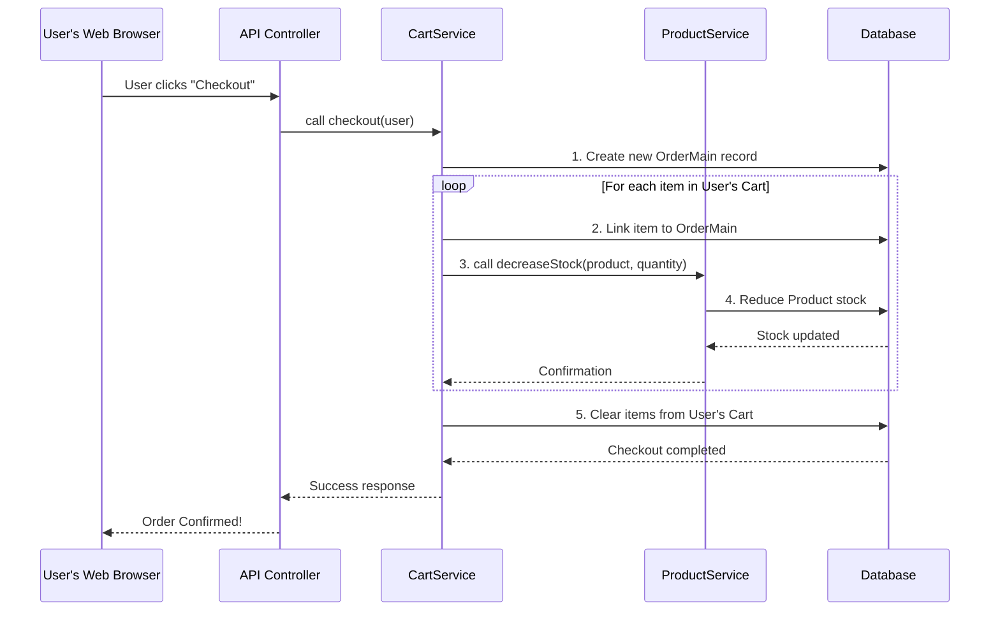

# Chapter 2: Business Services

Welcome back to our journey through the Online Shopping Store project! In the [previous chapter](01_data_models__entities__.md), we explored **Data Models (Entities)**. We learned that these are the blueprints for the information our store needs to manage, like `ProductInfo` for products and `User` for customers. They define *what* data we store and *how* it's structured in our database.

But knowing *what* data we have isn't enough. We need to be able to *do things* with that data. How do we add a product to a cart? How do we place an order? How do we update a product's stock when it's sold?

### What Problem Do Business Services Solve?

Imagine our online store as a bustling company.
*   The **[Data Models (Entities)](01_data_models__entities__.md)** are like the meticulously organized filing cabinets full of customer records, product catalogs, and order forms.
*   The **[API Controllers](04_api_controllers_.md)** (which we'll cover later) are like the "front desk" – they receive requests from customers (like "I want to buy this!") and decide which department should handle them.

Now, who actually *does* the work? Who goes to the filing cabinet, checks if a product is in stock, updates the quantity, calculates the total price, and then creates a new order form? That's where **Business Services** come in!

Think of **Business Services** as the **specialized departments** within our online store. Each department has a specific job and knows all the "how-to" instructions for performing that job according to the store's rules.

For example:
*   The "Product Department" (`ProductService`) knows how to check product stock, update prices, or mark a product as 'on sale'.
*   The "Cart Department" (`CartService`) knows how to add items to a user's shopping cart, remove them, or start the checkout process.
*   The "Order Department" (`OrderService`) is responsible for processing a new order, managing its status (like 'shipped' or 'cancelled'), and ensuring payments are handled.

These services contain the *core business logic*. They ensure that when you add something to a cart, the right product is picked, and when you place an order, the stock is correctly reduced and all relevant details are saved.

### Why Do We Need Services?

1.  **Organization**: Services keep all the "rules" and "how-to" steps in one dedicated place. This prevents our code from becoming a messy tangle where business logic is scattered everywhere.
2.  **Reusability**: If multiple parts of our application need to decrease product stock, they can all call the `ProductService.decreaseStock()` method. We write the logic once and reuse it.
3.  **Maintainability**: If a business rule changes (e.g., how stock is managed), we only need to update the logic in one service, not dozens of places.
4.  **Transactions**: Services ensure that complex operations (like placing an order, which involves many steps like creating an order record, updating individual product counts, and clearing the cart) either *all* succeed or *all* fail together. You wouldn't want an order to be placed but the stock not reduced!

### Service Interfaces: The "What"

In Java, it's a common and good practice to define services using **interfaces**. An interface is like a "contract" or a "menu" that declares *what* a service can do, without specifying *how* it does it.

Here are some examples of service interfaces from our project:

```java
// backend\src\main\java\me\zhulin\shopapi\service\CartService.java
package me.zhulin.shopapi.service;

import me.zhulin.shopapi.entity.Cart;
import me.zhulin.shopapi.entity.ProductInOrder;
import me.zhulin.shopapi.entity.User;
import java.util.Collection;

public interface CartService {
    Cart getCart(User user);
    void mergeLocalCart(Collection<ProductInOrder> productInOrders, User user);
    void delete(String itemId, User user);
    void checkout(User user); // This is our main use case!
}
```
*   This is the `CartService` interface. It lists methods like `checkout(User user)`. This tells us that the Cart Service *can* process a user's cart into an order, but it doesn't show the actual steps involved.

```java
// backend\src\main\java\me\zhulin\shopapi\service\ProductService.java
package me.zhulin.shopapi.service;

import me.zhulin.shopapi.entity.ProductInfo;
import org.springframework.data.domain.Page;
import org.springframework.data.domain.Pageable;

public interface ProductService {
    ProductInfo findOne(String productId);
    void increaseStock(String productId, int amount);
    void decreaseStock(String productId, int amount); // Another crucial method
    // ... other methods for managing products
}
```
*   Similarly, the `ProductService` interface declares methods like `decreaseStock()`, promising the ability to reduce a product's available quantity.

These interfaces are like the table of contents for our specialized departments. They define the public actions our application can take.

### Under the Hood: Service Implementations – The "How"

Now, let's look at how these actions are actually performed. For each interface, there's a corresponding **implementation class**. This class contains the actual code, the step-by-step instructions for each method declared in the interface.

Let's trace our use case: **Placing an order (Checkout)**.

When a user clicks "Checkout" in their shopping cart, here's a simplified sequence of what happens:



This diagram shows how different services (`CartService`, `ProductService`) work together, and how they interact with the [Database](01_data_models__entities__.md) through another component called [Data Repositories](03_data_repositories_.md) (which we'll cover next!).

Let's look at the actual code that performs these steps:

#### 1. `CartServiceImpl.checkout()`

```java
// backend\src\main\java\me\zhulin\shopapi\service\impl\CartServiceImpl.java
package me.zhulin.shopapi.service.impl;

import me.zhulin.shopapi.entity.OrderMain;
import me.zhulin.shopapi.entity.User;
// ... other imports
import me.zhulin.shopapi.service.ProductService; // We need ProductService here!
import org.springframework.beans.factory.annotation.Autowired;
import org.springframework.stereotype.Service;
import org.springframework.transaction.annotation.Transactional;

@Service // Marks this as a Spring Service component
public class CartServiceImpl implements CartService { // This class 'implements' the CartService interface
    @Autowired // Spring automatically provides an instance of ProductService
    ProductService productService;
    // @Autowired OrderRepository orderRepository; // Also interacts with repositories directly

    @Override
    @Transactional // Ensures all operations within this method either fully succeed or fail
    public void checkout(User user) {
        // Step 1: Create a new order based on the user's details
        OrderMain order = new OrderMain(user);
        // orderRepository.save(order); // Save this new order to the database

        // Step 2: Go through each product in the user's cart
        user.getCart().getProducts().forEach(productInOrder -> {
            productInOrder.setCart(null);      // Remove product from cart's link
            productInOrder.setOrderMain(order); // Link product to the new order

            // Step 3: Crucially, decrease the product stock using the ProductService
            productService.decreaseStock(productInOrder.getProductId(), productInOrder.getCount());
            // productInOrderRepository.save(productInOrder); // Save product's updated status

        });
        // Step 4: Logic to clear the cart (often done by the relationships/cascades or other operations)
    }
}
```
*   `@Service`: This special Spring annotation tells our application that `CartServiceImpl` is a business service. Spring will automatically find and manage it.
*   `implements CartService`: This line explicitly states that this class provides the actual working code for all the methods defined in the `CartService` interface.
*   `@Autowired ProductService productService;`: This is called **Dependency Injection**. Instead of `CartServiceImpl` manually creating a `ProductService`, Spring automatically "injects" (provides) an instance of `ProductService` for `CartServiceImpl` to use. This makes our code modular and easy to test.
*   `@Transactional`: This is very important! It ensures that the `checkout` operation is **atomic**. If any step inside this method fails (e.g., `decreaseStock` throws an error because there's not enough stock), *all* the database changes made during `checkout` will be undone, as if they never happened. This prevents half-completed orders and keeps our data consistent.
*   Inside `checkout`, you see the `productService.decreaseStock(...)` call. This is how services communicate with each other – the `CartService` *delegates* the task of managing stock to the `ProductService`, as `ProductService` is the specialist for that task.

#### 2. `ProductServiceImpl.decreaseStock()`

Now let's see what happens inside `ProductService` when `decreaseStock` is called:

```java
// backend\src\main\java\me\zhulin\shopapi\service\impl\ProductServiceImpl.java
package me.zhulin.shopapi.service.impl;

import me.zhulin.shopapi.entity.ProductInfo;
import me.zhulin.shopapi.enums.ResultEnum;
import me.zhulin.shopapi.exception.MyException;
// ... other imports
import org.springframework.beans.factory.annotation.Autowired;
import org.springframework.stereotype.Service;
import org.springframework.transaction.annotation.Transactional;

@Service
public class ProductServiceImpl implements ProductService {
    // @Autowired ProductInfoRepository productInfoRepository; // Interacts with repository

    @Override
    @Transactional
    public void decreaseStock(String productId, int amount) {
        // Step 1: Find the product in the database using its ID
        ProductInfo productInfo = findOne(productId); // findOne method retrieves from DB

        // Business Rule 1: Check if the product exists
        if (productInfo == null) throw new MyException(ResultEnum.PRODUCT_NOT_EXIST);

        // Step 2: Calculate the new stock level
        int update = productInfo.getProductStock() - amount;

        // Business Rule 2: Check if there's enough stock
        if(update <= 0) throw new MyException(ResultEnum.PRODUCT_NOT_ENOUGH );

        // Step 3: Update the product's stock and save it back to the database
        productInfo.setProductStock(update);
        // productInfoRepository.save(productInfo); // This saves the updated ProductInfo to the database
    }
}
```
*   This method contains the specific "how-to" for reducing stock. It first retrieves the product (using a `findOne` helper method, which ultimately talks to the [Data Repositories](03_data_repositories_.md)), then applies our **business rules**:
    *   Is the product valid?
    *   Is there enough stock?
*   If everything is good, it updates the stock quantity and saves the change. If a rule is violated, it throws an exception, and thanks to `@Transactional` in `CartServiceImpl.checkout()`, the entire order process will be rolled back.

### Other Important Services

Our project has several other services, each managing specific business logic:

*   **`CategoryService`**: Manages product categories. It knows how to find products within a category or list all categories.
*   **`UserService`**: Handles user-related operations like creating a new user, finding a user by email, or updating user information (including password encryption!).
*   **`OrderService`**: Manages the life cycle of orders *after* they are placed. It knows how to find orders, mark them as 'finished', or 'cancel' them (which involves putting stock back!).
*   **`ProductInOrderService`**: Specifically deals with updating or finding individual products that are already within a cart or an order.

### Conclusion

In this chapter, we've uncovered the "brains" of our online shopping store: **Business Services**. These are Java classes that encapsulate the core business logic and rules of our application. They act as specialized departments, taking raw requests (like "checkout") and executing them step-by-step, ensuring data integrity and following our store's policies. We saw how services interact with each other (like `CartService` using `ProductService`) and how `@Transactional` ensures operations are reliable.

Now that we understand *what* data we have ([Data Models (Entities)](01_data_models__entities__.md)) and *how* we perform operations on it (Business Services), the next question is: How do these services actually *talk* to the database to store and retrieve all that information? That's precisely what **[Data Repositories](03_data_repositories_.md)** are for!

Ready to see how services connect to our database? Let's dive into [Data Repositories](03_data_repositories_.md)!

---

Generated by [AI Codebase Knowledge Builder](https://github.com/The-Pocket/Tutorial-Codebase-Knowledge)