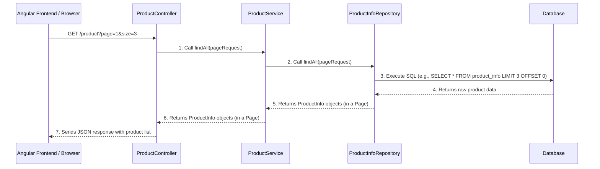

# Chapter 4: API Controllers

Welcome back! In [Chapter 1: Data Models (Entities)](01_data_models__entities__.md), we defined *what* data our store handles. In [Chapter 2: Business Services](02_business_services_.md), we learned *how* to apply business rules and perform actions on that data. And in [Chapter 3: Data Repositories](03_data_repositories_.md), we saw how our services talk to the database to store and retrieve information.

Now, it's time to connect our amazing backend to the outside world. How does a customer's web browser, or our Angular frontend, actually *talk* to our Spring Boot application to ask for products, add items to a cart, or log in? This is where **API Controllers** come in!

### What Problem Do API Controllers Solve?

Imagine our online store as a physical shop. You, the customer, walk in and go to the "front desk" or "receptionist". You tell them what you want: "Show me all the products," "I want to add this item to my cart," or "I want to log in."

In our online application, **API Controllers** are exactly like this "front desk" or "receptionist." They are the first point of contact for any request coming from outside our Spring Boot backend.

Their main job is to:
1.  **Receive Requests**: Listen for specific web addresses (URLs) and actions (like viewing, adding, or deleting).
2.  **Understand the Request**: Figure out what the user is trying to do (e.g., "GET products," "POST a new user").
3.  **Delegate the Work**: Hand off the complex tasks to the right "department" (our [Business Services](02_business_services_.md)).
4.  **Send Back Response**: Take the result from the service, format it (usually as JSON), and send it back to the user's browser or frontend application.

Without controllers, our [Business Services](02_business_services_.md) and [Data Repositories](03_data_repositories_.md) would be like brilliant chefs in a kitchen, but with no waiters to take orders or serve food!

### What are API Controllers in Our Project?

In our Spring Boot application, API Controllers are special **Java classes** that are designed to handle incoming web requests. They use specific Spring annotations to define which URLs they respond to and what HTTP actions (like GET, POST) they handle.

Let's look at the key concepts and annotations:

#### 1. `@RestController`: The "Front Desk" Label

```java
// Example usage:
@RestController
public class ProductController {
    // ... controller methods ...
}
```
*   `@RestController`: This is the most important annotation. It tells Spring: "This Java class is a web controller, and any data it returns from its methods should be automatically converted into a format like JSON (JavaScript Object Notation) and sent directly as the response body."

#### 2. HTTP Methods: Actions on the Web

When your browser or frontend talks to a server, it uses specific "methods" to indicate the type of action:

*   **`GET`**: To **get** (read) information. Example: "Show me all products."
*   **`POST`**: To **send** (create) new information. Example: "Register a new user," "Add an item to the cart."
*   **`PUT`**: To **update** existing information. Example: "Change the quantity of an item in the cart."
*   **`DELETE`**: To **remove** information. Example: "Delete a product from the store."
*   **`PATCH`**: To **partially update** information (like changing just one field).

#### 3. Mapping URLs to Methods: `@GetMapping`, `@PostMapping`, etc.

These annotations link a specific HTTP method and URL path to a method in your controller.

```java
// backend\src\main\java\me\zhulin\shopapi\api\ProductController.java
// ...
@RestController
public class ProductController {
    // Handles GET requests to /product
    @GetMapping("/product")
    public String getAllProducts() { /* ... */ return "List of Products"; }

    // Handles POST requests to /product/new
    @PostMapping("/product/new")
    public String createProduct() { /* ... */ return "Product Created!"; }
}
```
*   `@GetMapping("/product")`: This means when a `GET` request comes to the `/product` URL, the `getAllProducts()` method will be called.
*   `@PostMapping("/product/new")`: This means when a `POST` request comes to the `/product/new` URL, the `createProduct()` method will be called.

#### 4. Getting Data from Requests: `@PathVariable`, `@RequestParam`, `@RequestBody`

Controllers often need information from the incoming request.

*   **`@PathVariable`**: Extracts a value from the URL path itself.
    ```java
    // Example: GET /product/P001 (P001 is the product ID)
    @GetMapping("/product/{productId}")
    public ProductInfo showOne(@PathVariable("productId") String productId) {
        // 'productId' will be "P001"
        // ...
        return null;
    }
    ```

*   **`@RequestParam`**: Extracts a value from the URL's query parameters (after the `?`).
    ```java
    // Example: GET /product?page=2&size=10
    @GetMapping("/product")
    public String findAll(
            @RequestParam(value = "page", defaultValue = "1") Integer page,
            @RequestParam(value = "size", defaultValue = "3") Integer size) {
        // 'page' will be 2, 'size' will be 10
        // ...
        return null;
    }
    ```

*   **`@RequestBody`**: Converts JSON data sent in the request's "body" into a Java object. This is common for `POST` and `PUT` requests when sending complex data (like a new product's full details).
    ```java
    // Example: POST /product/new with JSON like {"productName": "Laptop", "productPrice": 1200}
    @PostMapping("/product/new")
    public String create(@RequestBody ProductInfo product) {
        // 'product' will be a Java object filled with data from the JSON
        // ...
        return null;
    }
    ```

#### 5. `@Autowired` for Services: Delegation

Just like in [Business Services](02_business_services_.md), controllers use `@Autowired` to get instances of the services they need. This is how they delegate the actual work.

```java
// backend\src\main\java\me\zhulin\shopapi\api\ProductController.java
// ...
import me.zhulin.shopapi.service.ProductService;

@RestController
public class ProductController {
    @Autowired // Spring provides an instance of ProductService for us
    ProductService productService;

    // ... methods that use productService ...
}
```

### Use Case: Showing All Products

Let's trace how a user's request to "show me all products" is handled by our `ProductController`.

Imagine a user's browser sends a request: `GET http://localhost:8080/product?page=1&size=3`

```java
// backend\src\main\java\me\zhulin\shopapi\api\ProductController.java
package me.zhulin.shopapi.api;

import me.zhulin.shopapi.entity.ProductInfo;
import me.zhulin.shopapi.service.ProductService;
import org.springframework.beans.factory.annotation.Autowired;
import org.springframework.data.domain.Page;
import org.springframework.data.domain.PageRequest;
import org.springframework.web.bind.annotation.*; // Contains all key annotations

@CrossOrigin // Allows requests from different domains (e.g., Angular frontend)
@RestController // Marks this as a controller that returns data directly
public class ProductController {
    @Autowired // Spring automatically provides an instance of ProductService
    ProductService productService;

    @GetMapping("/product") // Handles GET requests to /product
    public Page<ProductInfo> findAll(
            @RequestParam(value = "page", defaultValue = "1") Integer page, // Get 'page' from URL query
            @RequestParam(value = "size", defaultValue = "3") Integer size) { // Get 'size' from URL query

        // Convert page and size to a format Spring Data understands
        PageRequest request = PageRequest.of(page - 1, size);
        
        // Delegate the work to the ProductService to fetch product data
        return productService.findAll(request);
    }
}
```
**Explanation:**
1.  **Request Arrives**: The Spring Boot application receives the `GET /product?page=1&size=3` request.
2.  **Controller Match**: Spring sees the `@GetMapping("/product")` annotation and directs the request to the `findAll()` method in `ProductController`.
3.  **Parameter Extraction**:
    *   `@RequestParam` extracts `page=1` and `size=3` from the URL.
    *   `defaultValue` ensures that if `page` or `size` are not provided in the URL, they default to `1` and `3` respectively.
4.  **Service Call**: `findAll()` creates a `PageRequest` object (for pagination) and then calls `productService.findAll(request)`. This hands over the responsibility of actually fetching the products to our [ProductService](02_business_services_.md).
5.  **Response Generation**: The `ProductService` returns a `Page<ProductInfo>` object (a list of products plus pagination info). Because `ProductController` is a `@RestController`, Spring automatically converts this Java object into a JSON response, which is then sent back to the user's browser.

### Under the Hood: The Full Request Flow

Let's visualize the journey of a request from the user's browser all the way to the database and back, using our "Show All Products" example:



1.  The **Angular Frontend** (or any browser) sends a `GET` request to the `/product` URL.
2.  The **`ProductController`** receives this request, extracts the `page` and `size` parameters, and calls its injected **`ProductService`** to handle the actual data retrieval.
3.  The **`ProductService`** then uses its injected **`ProductInfoRepository`** to communicate with the database.
4.  The **`ProductInfoRepository`** (powered by Spring Data JPA and Hibernate) translates the request into an SQL query and sends it to the **Database**.
5.  The **Database** executes the query and sends the raw product data back to the `ProductInfoRepository`.
6.  The **`ProductInfoRepository`** converts this raw data into Java `ProductInfo` objects and returns them (wrapped in a `Page` object) to the `ProductService`.
7.  The **`ProductService`** sends the `Page<ProductInfo>` object back to the `ProductController`.
8.  Finally, the **`ProductController`** converts this Java object into a JSON response and sends it back to the **Frontend**, which then displays the products to the user.

### Other Controllers in Our Online Store

Our project has several other controllers, each acting as the "front desk" for specific areas of the store:

#### 1. `CartController`: Managing the Shopping Cart

This controller handles all operations related to a user's shopping cart.

```java
// backend\src\main\java\me\zhulin\shopapi\api\CartController.java
// ...
import me.zhulin.shopapi.form.ItemForm; // A simple class for product ID and quantity
import java.security.Principal; // Represents the logged-in user

@CrossOrigin
@RestController
@RequestMapping("/cart") // All methods in this controller start with /cart
public class CartController {
    @Autowired CartService cartService; // To handle cart business logic
    @Autowired UserService userService; // To get user details

    @PostMapping("/add") // POST request to /cart/add
    public boolean addToCart(@RequestBody ItemForm form, Principal principal) {
        // 'form' contains productId and quantity from request JSON
        // 'principal' represents the currently logged-in user
        var user = userService.findOne(principal.getName()); // Get user info
        cartService.mergeLocalCart(/* product data from form */ null, user); // Delegate to service
        return true; // Indicate success
    }

    @PostMapping("/checkout") // POST request to /cart/checkout
    public ResponseEntity checkout(Principal principal) {
        User user = userService.findOne(principal.getName());
        cartService.checkout(user); // Delegate to CartService to finalize order
        return ResponseEntity.ok(null); // Return a success response
    }
}
```
*   `@RequestMapping("/cart")`: All methods in this controller will respond to URLs starting with `/cart`.
*   `Principal principal`: This is a very useful object provided by Spring Security. It gives us details about the user who is currently logged in, allowing us to perform user-specific actions (like adding items to *their* cart).
*   `ResponseEntity.ok(null)`: Allows us to send a specific HTTP status code (like `200 OK`) and an empty body.

#### 2. `OrderController`: Managing Customer Orders

This controller deals with operations related to placing, viewing, canceling, or finishing orders.

```java
// backend\src\main\java\me\zhulin\shopapi\api\OrderController.java
// ...
import org.springframework.security.core.Authentication; // For security checks

@RestController
@CrossOrigin
public class OrderController {
    @Autowired OrderService orderService; // To handle order business logic

    @PatchMapping("/order/cancel/{id}") // PATCH request to /order/cancel/{orderId}
    public ResponseEntity<OrderMain> cancel(@PathVariable("id") Long orderId, Authentication authentication) {
        OrderMain orderMain = orderService.findOne(orderId);
        // Security check: Ensure the logged-in user owns this order (if customer)
        if (!authentication.getName().equals(orderMain.getBuyerEmail())) {
            return ResponseEntity.status(HttpStatus.UNAUTHORIZED).build();
        }
        return ResponseEntity.ok(orderService.cancel(orderId)); // Delegate to OrderService
    }
}
```
*   `@PatchMapping`: Used for partial updates to a resource, like just changing the status of an order.
*   `Authentication authentication`: Similar to `Principal`, this object provides more detailed information about the authenticated user, including their roles (e.g., "ROLE_CUSTOMER", "ROLE_ADMIN"), which is crucial for authorization checks.

#### 3. `UserController`: User Login and Registration

This controller handles user authentication (login) and registration.

```java
// backend\src\main\java\me\zhulin\shopapi\api\UserController.java
// ...
import me.zhulin.shopapi.vo.request.LoginForm; // Object to capture username/password
import me.zhulin.shopapi.vo.response.JwtResponse; // Response for login success

@CrossOrigin
@RestController
public class UserController {
    @Autowired UserService userService;
    // ... security related components ...

    @PostMapping("/login") // POST request to /login
    public ResponseEntity<JwtResponse> login(@RequestBody LoginForm loginForm) {
        try {
            // Authenticate user (details covered in Security chapter)
            // ...
            // If successful, return a JWT token and user info
            return ResponseEntity.ok(new JwtResponse(/* token, user info */));
        } catch (AuthenticationException e) {
            return ResponseEntity.status(HttpStatus.UNAUTHORIZED).build(); // 401 Unauthorized
        }
    }

    @PostMapping("/register") // POST request to /register
    public ResponseEntity<User> save(@RequestBody User user) {
        try {
            return ResponseEntity.ok(userService.save(user)); // Delegate to UserService to save new user
        } catch (Exception e) {
            return ResponseEntity.badRequest().build(); // 400 Bad Request if registration fails
        }
    }
}
```
*   `ResponseEntity.status(HttpStatus.UNAUTHORIZED).build()`: This allows the controller to return a specific HTTP status code (like 401 for unauthorized access) instead of just an object.
*   `LoginForm`: A simple Java class that holds the username and password sent by the user for login.

### Conclusion

In this chapter, we've explored **API Controllers**, the crucial "front desk" of our online shopping store. We learned how they receive requests from the outside world, interpret them using annotations like `@GetMapping`, `@PostMapping`, `@PathVariable`, and `@RequestBody`, and then delegate the real work to our [Business Services](02_business_services_.md).

Controllers are the bridge between our backend logic and the users or frontend applications. They ensure that requests are properly routed, data is correctly parsed, and responses are sent back in a structured way.

Now that our backend can receive requests and process them, the next vital step is to ensure that only authorized users can access sensitive features. This is where **Security** comes into play. In the next chapter, we'll dive into **JWT Authentication** to secure our online store!

Ready to make our store secure? Let's move on to [Security (JWT Authentication)](05_security__jwt_authentication__.md)!

---

Generated by [AI Codebase Knowledge Builder](https://github.com/The-Pocket/Tutorial-Codebase-Knowledge)
