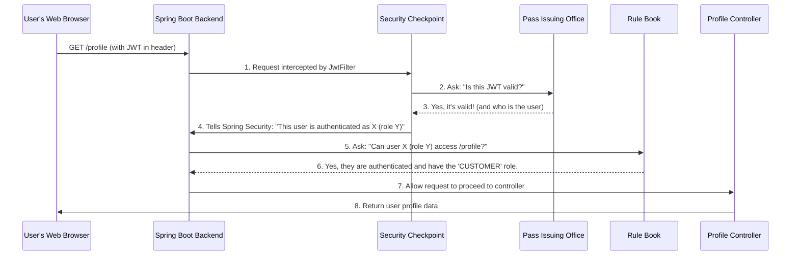

# Chapter 5: Security (JWT Authentication)

Welcome back, future online store moguls! In our previous chapters, we've built a solid foundation for our online store:
*   In [Chapter 1: Data Models (Entities)](01_data_models__entities__.md), we structured our data.
*   In [Chapter 2: Business Services](02_business_services_.md), we defined the core business logic.
*   In [Chapter 3: Data Repositories](03_data_repositories_.md), we learned how to save and retrieve data from the database.
*   And in [Chapter 4: API Controllers](04_api_controllers_.md), we created the "front desk" for our application, allowing users and our Angular frontend to send requests to our Spring Boot backend.

But what if *anyone* could send a request to delete a product or change an order status? That would be chaos! Our online store needs robust **security** to protect sensitive information and actions.

### What Problem Does Security (JWT Authentication) Solve?

Imagine our online store is a highly secure building.
*   Our **[API Controllers](04_api_controllers_.md)** are the receptionists who greet everyone at the entrance.
*   Our **[Business Services](02_business_services_.md)** are the specialized departments inside the building.
*   Our **[Data Repositories](03_data_repositories_.md)** are the record keepers in the archives.

Now, we need a **security system**. We can't let just anyone into the "manager's office" or the "shipping department." Only authorized personnel should be allowed.

This is where **Security (JWT Authentication)** comes in. It acts as the security checkpoint and access control for our entire store.

Here's the main idea:
1.  **Identify Yourself (Login)**: When a user logs in, they prove who they are (authentication).
2.  **Get a Special Pass (JWT Token)**: If their identity is verified, the system issues them a special, temporary access pass called a **JWT (JSON Web Token)**. This pass is digitally signed, so no one can fake it.
3.  **Show Your Pass (JWT Filter)**: For *every subsequent action* they want to perform (like adding to cart, viewing orders, or managing products), they must present this JWT pass.
4.  **Check the Pass and Rules (Spring Security Configuration)**: Our security system checks if the pass is valid and if the user (based on their role like `CUSTOMER`, `EMPLOYEE`, or `MANAGER`) has the necessary permissions to perform that specific action, based on predefined rules.
5.  **Access Granted or Denied (JWT Entry Point)**: If the pass is valid and permissions are granted, access is allowed. If the pass is invalid, expired, or the user doesn't have the right role, access is denied.

This system ensures that only legitimate and authorized users can interact with our store's valuable resources.

### Key Components of JWT Authentication in Our Project

Our security system is built using several key Spring Security components and custom classes for JWT handling:

#### 1. `JwtProvider`: The "Pass Issuing Office"

This component is responsible for creating (issuing) and validating the JWT tokens.

*   **What it does**: When a user successfully logs in, `JwtProvider` crafts a unique JWT token for them. It also knows how to verify if an incoming token is genuine and hasn't been tampered with or expired.
*   **Analogy**: It's like the office that prints and issues official temporary ID badges. It also has the special scanner to check if a badge is real.

#### 2. `JwtFilter`: The "Security Checkpoint"

This is a special filter that intercepts *every single incoming request* to our application.

*   **What it does**: It looks for the JWT token in the request. If found, it sends the token to `JwtProvider` for validation. If the token is valid, `JwtFilter` tells Spring Security who the user is and what roles they have, allowing the request to proceed to the next security checks.
*   **Analogy**: This is the security guard standing right at the entrance. Every person entering must show their ID badge to this guard.

#### 3. `SpringSecurityConfig`: The "Rule Book"

This is where we define the overall security rules for our entire application.

*   **What it does**: It specifies which URLs require authentication, which roles (`CUSTOMER`, `EMPLOYEE`, `MANAGER`) can access certain parts of the application, and how our JWT components should integrate into the security chain.
*   **Analogy**: This is the big rule book that tells the security guard: "Only people with a 'Manager' badge can enter the 'Product Stock Room'," or "Everyone needs a badge to enter the 'Order Processing' area."

#### 4. `JwtEntryPoint`: The "Access Denied Message"

This component handles what happens when an unauthenticated user tries to access a secured resource.

*   **What it does**: If someone tries to access a restricted area without a valid token, or if their token is invalid, `JwtEntryPoint` sends back an "Unauthorized" (401) error message.
*   **Analogy**: This is the polite but firm "Access Denied" sign, or the security guard telling you, "Sorry, your badge isn't valid; you cannot enter."

### Use Case: Logging In and Accessing a Secured Feature

Let's trace how a user logs in and then tries to view their profile, which is a secured feature.

**Step 1: User Logs In (Authentication)**

1.  The Angular frontend sends a `POST` request to `/login` with the user's email and password. This is handled by our `UserController` (from [Chapter 4: API Controllers](04_api_controllers_.md)).

    ```java
    // backend\src\main\java\me\zhulin\shopapi\api\UserController.java (simplified)
    // ...
    import me.zhulin.shopapi.vo.request.LoginForm;
    import me.zhulin.shopapi.vo.response.JwtResponse;
    // ...
    @RestController
    @CrossOrigin
    public class UserController {
        // ... (other autowired services for authentication) ...
        @Autowired JwtProvider jwtProvider; // Autowire JwtProvider

        @PostMapping("/login")
        public ResponseEntity<JwtResponse> login(@RequestBody LoginForm loginForm) {
            // ... authenticate user with Spring Security ...
            // If authentication is successful:
            String jwt = jwtProvider.generate(/* authentication object */); // Ask JwtProvider to generate token
            return ResponseEntity.ok(new JwtResponse(jwt, /* user info */)); // Return token to frontend
        }
    }
    ```
    *   **Explanation**: The `UserController` receives the login details. If the username and password are correct, it asks the `jwtProvider` to `generate` a new token. This token, along with some user information, is sent back to the Angular frontend. The frontend will store this token and use it for all future authenticated requests.

**Step 2: User Accesses a Secured Page (Authorization)**

Now the user wants to see their profile, which is protected. The Angular frontend will send a `GET` request to `/profile` and include the JWT token it received in the previous step, typically in the `Authorization` header.



Let's look at the code for each part of this flow:

### Under the Hood: The Security Implementation

#### 1. `JwtProvider`: Generating and Validating the Token

The `JwtProvider` is where the JWT tokens are actually created and verified.

```java
// backend\src\main\java\me\zhulin\shopapi\security\JWT\JwtProvider.java (simplified)
package me.zhulin.shopapi.security.JWT;

import io.jsonwebtoken.Jwts;
import io.jsonwebtoken.SignatureAlgorithm;
import org.springframework.security.core.Authentication;
import org.springframework.security.core.userdetails.UserDetails;
import org.springframework.stereotype.Component;
import java.util.Date;

@Component // Spring manages this component
public class JwtProvider {
    // ... JWT secret key and expiration time are configured elsewhere ...

    public String generate(Authentication authentication) {
        UserDetails userDetails = (UserDetails) authentication.getPrincipal();
        return Jwts.builder()
                .setSubject(userDetails.getUsername()) // Who is this token for? (e.g., user's email)
                .setIssuedAt(new Date())                // When was it issued?
                .setExpiration(new Date(new Date().getTime() + 1000 * /* jwtExpiration */)) // When does it expire?
                .signWith(SignatureAlgorithm.HS512, /* jwtSecret */) // Sign with a secret key
                .compact(); // Build and compress the token
    }

    public boolean validate(String token) {
        try {
            Jwts.parser().setSigningKey(/* jwtSecret */).parseClaimsJws(token);
            return true; // Token is valid
        } catch (Exception e) {
            // Log error if token is expired, invalid, etc.
            return false; // Token is NOT valid
        }
    }

    public String getUserAccount(String token) {
        // Extract the username (subject) from the token
        return Jwts.parser().setSigningKey(/* jwtSecret */).parseClaimsJws(token).getBody().getSubject();
    }
}
```
*   **`@Component`**: Makes this class a Spring-managed component so it can be `@Autowired` into other classes.
*   **`generate(Authentication authentication)`**: This method takes Spring's `Authentication` object (which holds details about the logged-in user) and uses the `Jwts.builder()` to create the JWT. It sets the subject (usually the username/email), issuance date, expiration date, and signs it with a secret key (`jwtSecret`).
*   **`validate(String token)`**: This method tries to parse and verify the signature of the token using the secret key. If anything is wrong (like invalid signature or expired token), it throws an exception, and the method returns `false`.
*   **`getUserAccount(String token)`**: If the token is valid, this method can extract the username (or user account) from it.

#### 2. `JwtFilter`: The Security Checkpoint in Action

This filter gets executed for every incoming request and uses `JwtProvider` to validate the token.

```java
// backend\src\main\java\me\zhulin\shopapi\security\JWT\JwtFilter.java (simplified)
package me.zhulin.shopapi.security.JWT;

import me.zhulin.shopapi.entity.User;
import me.zhulin.shopapi.service.UserService;
import org.springframework.security.authentication.UsernamePasswordAuthenticationToken;
import org.springframework.security.core.context.SecurityContextHolder;
import org.springframework.web.filter.OncePerRequestFilter;
import javax.servlet.FilterChain;
import javax.servlet.http.HttpServletRequest;
import javax.servlet.http.HttpServletResponse;
import java.io.IOException;

@Component
public class JwtFilter extends OncePerRequestFilter { // Ensures it runs once per request
    @Autowired JwtProvider jwtProvider;
    @Autowired UserService userService; // To get full user details by username/email

    @Override
    protected void doFilterInternal(HttpServletRequest request,
                                    HttpServletResponse response,
                                    FilterChain filterChain) throws ServletException, IOException {
        String jwt = getToken(request); // 1. Get token from Authorization header

        if (jwt != null && jwtProvider.validate(jwt)) { // 2. Validate token using JwtProvider
            String userEmail = jwtProvider.getUserAccount(jwt); // 3. Get user's email from token
            User user = userService.findOne(userEmail); // 4. Load user from database (via UserService)

            // 5. Tell Spring Security who the user is and what roles they have
            UsernamePasswordAuthenticationToken auth =
                new UsernamePasswordAuthenticationToken(user.getEmail(), null, user.getAuthorities());
            SecurityContextHolder.getContext().setAuthentication(auth);
        }
        filterChain.doFilter(request, response); // Proceed to the next filter/controller
    }

    private String getToken(HttpServletRequest request) {
        String authHeader = request.getHeader("Authorization"); // Look for "Bearer <token>"
        if (authHeader != null && authHeader.startsWith("Bearer ")) {
            return authHeader.replace("Bearer ", "");
        }
        return null;
    }
}
```
*   **`OncePerRequestFilter`**: Guarantees that this filter runs only once for each incoming HTTP request.
*   **`getToken(HttpServletRequest request)`**: This helper method extracts the JWT token from the `Authorization` header of the HTTP request (where it's typically sent as `Bearer <token>`).
*   **`doFilterInternal(...)`**: This is the core method.
    1.  It gets the token.
    2.  It calls `jwtProvider.validate()` to check if the token is valid.
    3.  If valid, it extracts the username from the token and uses `userService.findOne()` (from [Chapter 2: Business Services](02_business_services_.md)) to load the full user details.
    4.  Crucially, it then creates a `UsernamePasswordAuthenticationToken` and sets it in `SecurityContextHolder.getContext().setAuthentication(auth)`. This tells Spring Security: "Hey, for *this specific request*, this is the authenticated user, and these are their roles." Subsequent security checks (like those defined in `SpringSecurityConfig`) will use this information.

#### 3. `JwtEntryPoint`: Handling Unauthorized Access

If the `JwtFilter` finds an invalid token, or if a secured resource is accessed without any token, `JwtEntryPoint` takes over.

```java
// backend\src\main\java\me\zhulin\shopapi\security\JWT\JwtEntryPoint.java (simplified)
package me.zhulin.shopapi.security.JWT;

import org.springframework.security.core.AuthenticationException;
import org.springframework.security.web.AuthenticationEntryPoint;
import org.springframework.stereotype.Component;
import javax.servlet.http.HttpServletRequest;
import javax.servlet.http.HttpServletResponse;
import java.io.IOException;

@Component
public class JwtEntryPoint implements AuthenticationEntryPoint {
    // This method is called if an unauthenticated user tries to access a secured resource
    @Override
    public void commence(HttpServletRequest request,
                         HttpServletResponse response,
                         AuthenticationException authException) throws IOException {
        // Log the error
        response.setStatus(HttpServletResponse.SC_UNAUTHORIZED); // Send 401 Unauthorized status
        // You could also send a custom error message body here
    }
}
```
*   **`AuthenticationEntryPoint`**: This interface is used by Spring Security to handle authentication failures.
*   **`commence(...)`**: When an unauthenticated user tries to access a resource that requires authentication, this method is triggered. It simply sets the HTTP response status to `401 Unauthorized`, informing the client that they don't have permission.

#### 4. `SpringSecurityConfig`: The Central Rule Book

This configuration class ties everything together, defining authentication providers, security rules, and integrating our JWT components.

```java
// backend\src\main\java\me\zhulin\shopapi\security\SpringSecurityConfig.java (simplified)
package me.zhulin.shopapi.security;

import me.zhulin.shopapi.security.JWT.JwtEntryPoint;
import me.zhulin.shopapi.security.JWT.JwtFilter;
import org.springframework.security.config.annotation.web.builders.HttpSecurity;
import org.springframework.security.config.annotation.web.configuration.EnableWebSecurity;
import org.springframework.security.config.annotation.web.configuration.WebSecurityConfigurerAdapter;
import org.springframework.security.config.http.SessionCreationPolicy;
import org.springframework.security.web.authentication.UsernamePasswordAuthenticationFilter;
import org.springframework.beans.factory.annotation.Autowired;
import org.springframework.context.annotation.Configuration;

@Configuration
@EnableWebSecurity // Activates Spring Security
public class SpringSecurityConfig extends WebSecurityConfigurerAdapter {
    @Autowired JwtFilter jwtFilter; // Our JWT filter
    @Autowired JwtEntryPoint accessDenyHandler; // Our unauthorized access handler

    @Override
    protected void configure(HttpSecurity http) throws Exception {
        http.cors().and().csrf().disable() // Enable CORS, disable CSRF for API
            .authorizeRequests() // Define authorization rules

            // Rule 1: /profile/** URLs require any authenticated user
            .antMatchers("/profile/**").authenticated()

            // Rule 2: /cart/** URLs require a user with 'CUSTOMER' role
            .antMatchers("/cart/**").access("hasAnyRole('CUSTOMER')")

            // Rule 3: /order/finish/** requires 'EMPLOYEE' or 'MANAGER' roles
            .antMatchers("/order/finish/**")
            .access("hasAnyRole('EMPLOYEE', 'MANAGER')")

            // Rule 4: /seller/product/new requires 'MANAGER' role
            .antMatchers("/seller/product/new").access("hasAnyRole('MANAGER')")

            // Rule 5: All other /seller/** URLs require 'EMPLOYEE' or 'MANAGER'
            .antMatchers("/seller/**")
            .access("hasAnyRole('EMPLOYEE', 'MANAGER')")

            // Rule 6: All other requests are permitted without authentication
            .anyRequest().permitAll()

            .and() // More configuration
            .exceptionHandling().authenticationEntryPoint(accessDenyHandler) // Handle access denied
            .and()
            .sessionManagement().sessionCreationPolicy(SessionCreationPolicy.STATELESS); // No HTTP sessions

        // Add our custom JWT filter BEFORE Spring's standard authentication filter
        http.addFilterBefore(jwtFilter, UsernamePasswordAuthenticationFilter.class);
    }

    // ... (other configurations for authentication manager and user details service) ...
}
```
*   **`@EnableWebSecurity`**: This annotation is crucial; it enables Spring Security's web security features.
*   **`configure(HttpSecurity http)`**: This method is where we define the security rules for different HTTP requests.
    *   `http.cors().and().csrf().disable()`: Configures Cross-Origin Resource Sharing (CORS) to allow requests from different domains (like our Angular frontend) and disables Cross-Site Request Forgery (CSRF) protection, which is common for stateless APIs using JWTs.
    *   `.authorizeRequests()`: Starts defining authorization rules.
    *   **`.antMatchers("/profile/**").authenticated()`**: This is a rule. It says any URL starting with `/profile/` (e.g., `/profile`, `/profile/details`) can only be accessed by users who are `authenticated` (have a valid JWT).
    *   **`.antMatchers("/cart/**").access("hasAnyRole('CUSTOMER')")`**: This rule says that to access any URL under `/cart/`, the authenticated user must have the `CUSTOMER` role.
    *   **`.anyRequest().permitAll()`**: This is a catch-all. Any request not covered by the `antMatchers` rules above will be `permitAll()` (allowed without authentication). URLs like `/login` and `/register` fall under this.
    *   `.exceptionHandling().authenticationEntryPoint(accessDenyHandler)`: This tells Spring Security to use our `JwtEntryPoint` whenever an authentication error occurs (e.g., missing or invalid token).
    *   `.sessionManagement().sessionCreationPolicy(SessionCreationPolicy.STATELESS)`: This is vital for JWT. It tells Spring not to create or use HTTP sessions. Each request carries its own authentication (the JWT), making the API "stateless" (the server doesn't remember previous requests from a user).
    *   **`http.addFilterBefore(jwtFilter, UsernamePasswordAuthenticationFilter.class)`**: This line integrates our `JwtFilter` into Spring Security's filter chain. It ensures that our `JwtFilter` runs *before* Spring's default authentication filter, allowing us to process JWTs early in the request lifecycle.

### Conclusion

In this chapter, we've explored the critical concept of **Security (JWT Authentication)** in our online shopping store. We learned how JWTs act as temporary access passes, issued upon successful login, and how they are used for every subsequent request to prove a user's identity and permissions. We dived into the roles of `JwtProvider` (issuing and validating tokens), `JwtFilter` (the security checkpoint), `SpringSecurityConfig` (the rule book for access control), and `JwtEntryPoint` (handling access denials).

This security layer ensures that our online store is protected, allowing only the right users to perform the right actions based on their roles.

Now that our application can handle data, business logic, API calls, and is secure, the final piece is understanding how all these components are brought together and how the application starts up. In the next chapter, we'll look at **Application Configuration & Startup**!

Ready to launch our store? Let's move on to [Application Configuration & Startup](06_application_configuration___startup_.md)!

---

Generated by [AI Codebase Knowledge Builder](https://github.com/The-Pocket/Tutorial-Codebase-Knowledge)
