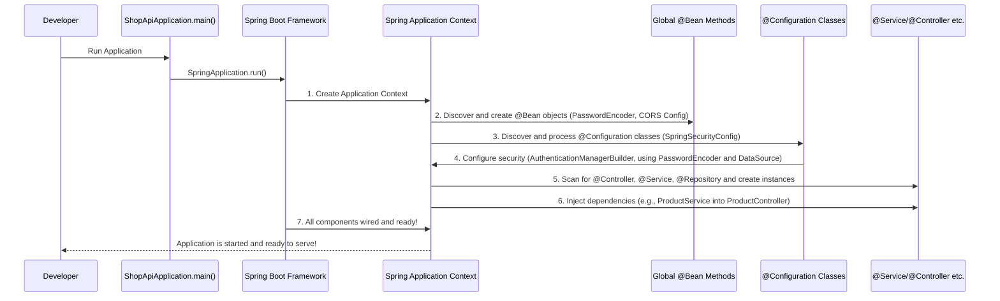

# Chapter 6: Application Configuration & Startup

Welcome to the final chapter of our deep dive into the Spring Boot and Angular Online Shopping Store project! In our previous chapters, we've carefully constructed all the vital parts of our backend:
*   [Chapter 1: Data Models (Entities)](01_data_models__entities__.md) laid out the blueprints for our data.
*   [Chapter 2: Business Services](02_business_services_.md) built the "brains" that handle our store's logic.
*   [Chapter 3: Data Repositories](03_data_repositories_.md) gave our services the ability to talk to the database.
*   [Chapter 4: API Controllers](04_api_controllers_.md) opened up the "front desk" for our Angular frontend to send requests.
*   And [Chapter 5: Security (JWT Authentication)](05_security__jwt_authentication__.md) put a robust security system in place to protect our store.

Now, imagine you've built a fantastic house. You have the foundation, the rooms, the furniture, and even a security system. But how do you actually turn on the lights, connect the water, and officially open the doors for residents? This is where **Application Configuration & Startup** comes in!

### What Problem Does Application Configuration & Startup Solve?

All the amazing components we've discussed (controllers, services, repositories, security filters) are just Java classes and interfaces. They don't magically start working on their own.

**Application Configuration & Startup** is the **main power switch and the general contractor** for our entire online store application. It's the crucial step that:
1.  **Boots up the Application**: Gets everything running from scratch.
2.  **Discovers and Wires Components**: Finds all our `@Service`, `@Repository`, `@Controller`, and `@Configuration` classes and connects them together (this is Spring's famous "Dependency Injection" in action, where Spring automatically provides instances of needed classes, like `ProductService` to `ProductController`).
3.  **Applies Global Settings**: Sets up critical, application-wide rules and components that affect how *every* part of the store operates. This includes things like:
    *   **How Passwords are Encoded**: Ensuring user passwords are saved securely.
    *   **Cross-Origin Communication (CORS)**: Allowing our Angular frontend (running on a different web address) to talk to our Spring Boot backend smoothly.
    *   **Database Connection**: Making sure our application can connect to and use the database.

Without this central setup, our application would be a collection of disconnected parts. It's the launchpad that ensures all other components are properly configured and ready to handle incoming requests from our customers.

### The Core: `ShopApiApplication.java`

Every Spring Boot application has a main entry point, usually a class with a `main` method. In our project, this is the `ShopApiApplication.java` file.

```java
// backend\src\main\java\me\zhulin\shopapi\ShopApiApplication.java
package me.zhulin.shopapi;

import org.springframework.boot.SpringApplication;
import org.springframework.boot.autoconfigure.SpringBootApplication;
import org.springframework.context.annotation.Bean;
import org.springframework.security.crypto.bcrypt.BCryptPasswordEncoder; // Used for password encoding
import org.springframework.security.crypto.password.PasswordEncoder; // Interface for password encoding
import org.springframework.web.servlet.config.annotation.CorsRegistry; // For CORS configuration
import org.springframework.web.servlet.config.annotation.WebMvcConfigurer; // For CORS configuration
import org.springframework.web.servlet.config.annotation.WebMvcConfigurerAdapter; // Deprecated but used in project

@SpringBootApplication // 1. Main annotation for Spring Boot
public class ShopApiApplication {

    // 2. Defines how passwords will be encoded globally
    @Bean
    public PasswordEncoder passwordEncoder() {
        return new BCryptPasswordEncoder();
    }

    // 3. Configures Cross-Origin Resource Sharing (CORS)
    @Bean
    public WebMvcConfigurer corsConfigurer() {
        return new WebMvcConfigurerAdapter() {
            @Override
            public void addCorsMappings(CorsRegistry registry) {
                registry.addMapping("/**"); // Allow all origins for all paths
            }
        };
    }

    // 4. The actual entry point when you run the application
    public static void main(String[] args) {
        SpringApplication.run(ShopApiApplication.class, args);
    }

}
```

Let's break down this crucial file:

1.  **`@SpringBootApplication`**:
    *   This is a convenience annotation that combines three powerful Spring Boot annotations: `@Configuration`, `@EnableAutoConfiguration`, and `@ComponentScan`.
    *   Think of it as telling Spring Boot: "This is where our application starts! Please automatically configure everything you can, find all our components (like controllers, services, repositories, and other configurations), and get them ready."
    *   It's like the "General Contractor" for your house, telling the team to start building and connecting everything.

2.  **`main(String[] args)` method**:
    *   This is the standard Java entry point. When you "run" your Spring Boot application (e.g., from your IDE or command line), this method is executed.
    *   `SpringApplication.run(ShopApiApplication.class, args);` is the line that actually starts the Spring Boot machinery. It creates the Spring application context, which is like the central "control panel" that manages all the beans and configurations of our application.
    *   This is like flipping the **main power switch** for your house – everything lights up and becomes active!

3.  **`passwordEncoder()` method with `@Bean`**:
    *   `@Bean`: This annotation tells Spring that the method `passwordEncoder()` will produce a "bean" (an object that Spring manages). Spring will then make this `PasswordEncoder` object available for use throughout our application.
    *   `BCryptPasswordEncoder`: This is a specific implementation of `PasswordEncoder` that securely hashes (encodes) passwords using the BCrypt algorithm.
    *   **Why it's important**: When a user registers or logs in, their password needs to be securely stored and checked. We don't store plain text passwords! By defining `PasswordEncoder` as a global `@Bean`, any part of our application that needs to encode or verify a password (like our [UserService](02_business_services_.md) or [SpringSecurityConfig](05_security__jwt_authentication__.md)) can simply ask Spring for this `passwordEncoder` bean, and Spring will provide the correct, globally configured instance.
    *   This is like installing a **specialized, secure lock system** for all the doors in your house. Once configured here, any door can use this system without needing to know *how* it works internally.

4.  **`corsConfigurer()` method with `@Bean`**:
    *   `CORS` stands for **Cross-Origin Resource Sharing**. This is a security feature built into web browsers. By default, a web page loaded from one domain (e.g., `http://localhost:4200` for our Angular frontend) is not allowed to make requests to a different domain (e.g., `http://localhost:8080` for our Spring Boot backend). This prevents malicious websites from making requests on your behalf.
    *   **Why it's important**: Since our Angular frontend and Spring Boot backend run on different "origins" (different ports/addresses), we need to explicitly tell the browser that it's okay for our Angular app to talk to our Spring Boot app.
    *   The `corsConfigurer()` bean sets up these rules. `registry.addMapping("/**")` is a very permissive rule that says "allow requests from any origin to any path on our backend." In a real production application, you would make this much stricter, allowing only your Angular frontend's specific domain.
    *   This is like setting up a **"Welcome Mat" and opening the gates** for specific visitors (our Angular frontend) to easily enter and leave your house (the backend) without security alarms going off.

### Connecting the Global Pieces: `SpringSecurityConfig` Revisited

In [Chapter 5: Security (JWT Authentication)](05_security__jwt_authentication__.md), we briefly touched on `SpringSecurityConfig`. Let's look at how it integrates with the global configuration defined in `ShopApiApplication.java` during startup.

When `SpringApplication.run()` executes, it finds our `SpringSecurityConfig` class (because it's marked `@Configuration`). This class then uses the globally available `PasswordEncoder` and connects to the database (`DataSource`) to set up how users are authenticated.

```java
// backend\src\main\java\me\zhulin\shopapi\security\SpringSecurityConfig.java (simplified for startup relevance)
package me.zhulin.shopapi.security;

// ... other imports ...
import org.springframework.security.config.annotation.authentication.builders.AuthenticationManagerBuilder;
import org.springframework.security.crypto.password.PasswordEncoder; // The global PasswordEncoder
import javax.sql.DataSource; // To connect to the database for user details

@Configuration // Marks this as a configuration class
public class SpringSecurityConfig extends WebSecurityConfigurerAdapter{

    // Spring will automatically provide the PasswordEncoder defined in ShopApiApplication.java
    @Autowired
    private PasswordEncoder passwordEncoder;

    // Spring will automatically provide the DataSource (database connection details)
    @Autowired
    private DataSource dataSource;

    // This method configures how Spring Security should find and authenticate users
    @Override
    public void configure(AuthenticationManagerBuilder auth) throws Exception{
        auth
                .jdbcAuthentication() // Use JDBC to query the database
                .usersByUsernameQuery("${spring.queries.users-query}") // SQL query to find user by username
                .authoritiesByUsernameQuery("${spring.queries.roles-query}") // SQL query to find user roles
                .dataSource(dataSource) // Use the injected database connection
                .passwordEncoder(passwordEncoder); // Use the injected password encoder
    }

    // ... other security configurations (like JWT filter chain) ...
}
```

**Explanation:**
*   `@Autowired private PasswordEncoder passwordEncoder;`: Spring automatically "injects" the `BCryptPasswordEncoder` instance that was created as a `@Bean` in `ShopApiApplication.java`. This means our security configuration uses the *same* password encoding mechanism defined globally.
*   `@Autowired private DataSource dataSource;`: Similarly, Spring automatically provides the `DataSource` bean, which contains the details to connect to our database. (Database configuration itself is usually done in `application.properties` or `application.yml` files, which Spring Boot automatically reads during startup).
*   `configure(AuthenticationManagerBuilder auth)`: This method is vital for security. It tells Spring Security *how* to authenticate users. Here, we configure it to use `jdbcAuthentication()`, meaning it will query our database (using the `dataSource`) with specific SQL queries (`users-query` and `roles-query` usually defined in `application.properties`) to find user details and their roles. Crucially, it uses the globally provided `passwordEncoder` to verify the password against the stored hash.

This demonstrates how our global components set up in `ShopApiApplication` are then seamlessly integrated and used by other parts of the application, like the security system, during the startup phase.

### Under the Hood: The Startup Flow

When you hit "run" on your Spring Boot application, here's a simplified sequence of what happens:



1.  **Run `main`**: You execute the `main` method in `ShopApiApplication`.
2.  **Spring Boot Takes Over**: `SpringApplication.run()` initiates the Spring Boot startup process.
3.  **Context Creation**: Spring Boot creates the "Application Context," which is like a central registry for all the objects (beans) in your application.
4.  **Global Beans**: It finds methods annotated with `@Bean` (like `passwordEncoder()` and `corsConfigurer()`) and creates those objects, adding them to the Application Context, making them available globally.
5.  **Configuration Classes**: It discovers configuration classes like `SpringSecurityConfig` (due to `@Configuration` and `@SpringBootApplication`'s scanning). Inside these, it processes further setup, such as configuring the security system with the database and the already-created `PasswordEncoder` bean.
6.  **Component Scanning & Wiring**: Spring Boot scans for all other `@Service`, `@Repository`, `@Controller`, and `@Component` annotations. It creates instances of these classes and, using Dependency Injection (`@Autowired`), automatically provides them with any other beans they need from the Application Context. For example, it gives `ProductController` an instance of `ProductService`.
7.  **Application Ready**: Once all components are created, configured, and wired together, the application is fully started and ready to listen for incoming web requests on the specified port (usually 8080).

### Conclusion

In this chapter, we've explored **Application Configuration & Startup**, the critical process that brings our entire online store to life. We learned that the `ShopApiApplication.java` class is the main entry point, using `@SpringBootApplication` to orchestrate the entire launch. We saw how global components like the `PasswordEncoder` (for secure password handling) and `CORS` configuration (for frontend-backend communication) are set up as `@Bean`s, making them available throughout the application. Finally, we understood how these global settings are integrated into other core parts, like our `SpringSecurityConfig`, ensuring that our security system uses the correct password encoding and connects to the database for user authentication right from the start.

With this, you now have a comprehensive understanding of how the Spring Boot backend of our Online Shopping Store is structured, how its different parts work together, and how it all comes to life!

Congratulations on completing this tutorial! You've gained foundational knowledge in building robust and secure web applications with Spring Boot.

---

Generated by [AI Codebase Knowledge Builder](https://github.com/The-Pocket/Tutorial-Codebase-Knowledge)