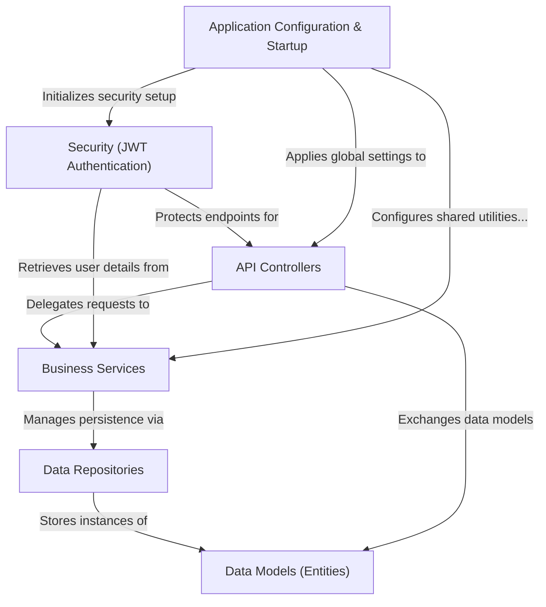

# Tutorial: SpringBoot-Angular7-Online-Shopping-Store-master

This project is a **backend system** for an *online shopping store*. It allows users to
**browse products**, *add items to their cart*, and **place orders**. It also handles
*user authentication and authorization* to ensure secure access for different roles
like customers, employees, and managers.

**Source Repository:** [None](None)

## Chapters

1. [Data Models (Entities)
](01_data_models__entities__.md)
2. [Business Services
](02_business_services_.md)
3. [Data Repositories
](03_data_repositories_.md)
4. [API Controllers
](04_api_controllers_.md)
5. [Security (JWT Authentication)
](05_security__jwt_authentication__.md)
6. [Application Configuration & Startup
](06_application_configuration___startup_.md)

---

Generated by [AI Codebase Knowledge Builder](https://github.com/The-Pocket/Tutorial-Codebase-Knowledge)